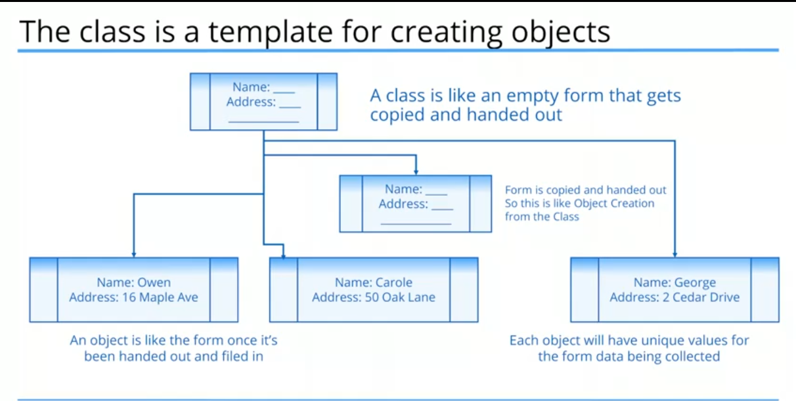

#+STARTUP: inlineimages
#+title: Intro to OOP

** Class

A class is an empty form or blueprint that gets copied and handed out

الclass هو نموذج بيتنسخ ويتعمل منه كائنات مستقلة

** Object

A object is an actual embodiment or instance of a class in memory

** Static field vs Instance field

| Static field                         | Instance field                         |
|--------------------------------------+----------------------------------------|
| field value stored once in a special | field value only stored when an object |
| location in memory.                  | is created                             |
|--------------------------------------+----------------------------------------|
| field accessed through the class     | field access through the object        |
| itself.                              |                                        |
|--------------------------------------+----------------------------------------|
| Example:                             | Example:                               |
| Integer.parseInt("123")              | myObject.myField                       |
