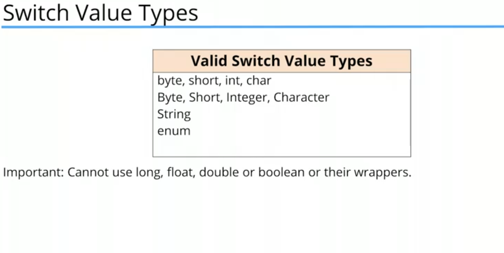

#+TITLE: Switch Statements/Expressions
#+STARTUP: inlineimages

** الswitch في Java زي C, ولكن Java عندها مميزات زيادة

#+CAPTION: Allowed types in java's Switch
#+ATTR_ORG: :align left

**1- Strings**

- في Java ممكن تعمل  switch علي String, و Java خلف الكواليس بتقارن ما بين الstrings وبعضها من خلال الbyte code بتاعهم

#+BEGIN_SRC java
    public static void main(String[] args) {
        String name = "Ali";
        int x = 4;

        switch (name) {
            case "Ziad":
                System.out.println("Hello " + name);
                break;
            case "Ahmed":
                System.out.println("Hi " + name);
                break;
            case "Ali":
                System.out.println("Welcome " + name);
                break;
            case "Nobody":
            default:
                System.out.println("Hello Anonymous");
        }
    }
#+END_SRC

**2- Switch Expression**

- الswitch في Java +14 بقا عبارة عن expression بيرجع قيمة.
- الarrow بيمنع الfall through فا مش محتاجين نستخدم `break`
- لو الcase اكتر من سطر وعاوز ترجع القيمة في الاخر بتستخدم `yield`
- مينفعش تجمع الdefault مع case تانية ومينفعش تجمع كذا case لو الbody بتاعهم اكتر من سطر

#+BEGIN_SRC java

  String name = "Ali";

  String greet = switch (name) {
      case "Ziad" -> "Hello " + name;
      case "Ahmed" -> "Hi " + name;
      case "Ali" -> "Welcome " + name;
      default -> {
          String anonymousGreet = "Hello Anonymous";
          yield anonymousGreet;
      }
  };

  System.out.println(greet);

#+END_SRC

